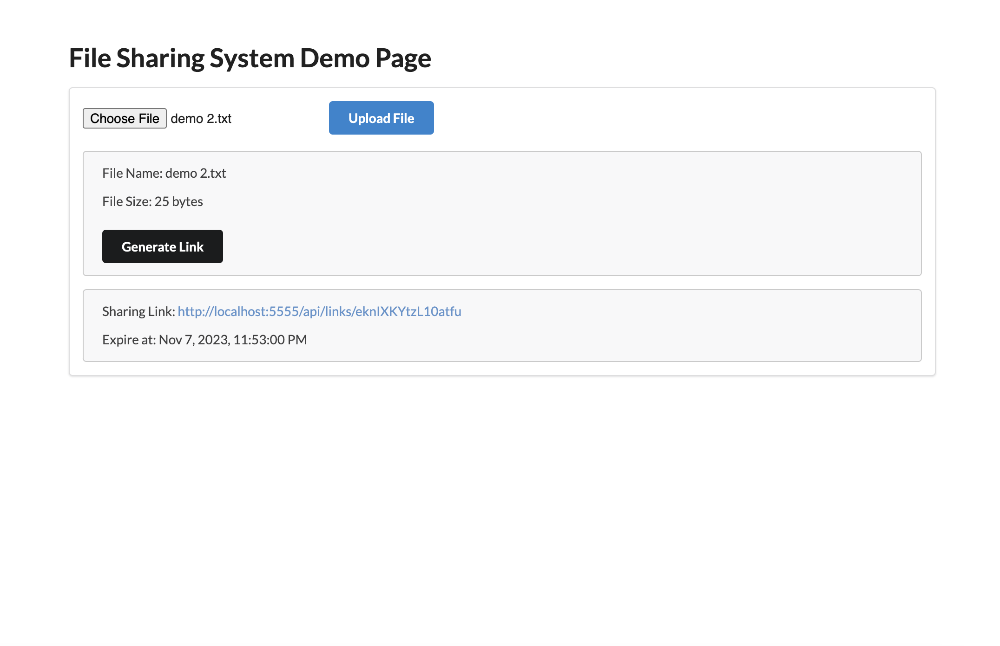

# File Sharing Application
### Overview
This File Sharing System is designed to provide a simple and intuitive platform for users to upload, download, and share files. The system is built using Angular for the frontend, Spring Boot for the backend, and MongoDB as the database. AWS S3 is utilized for storing the actual files, ensuring scalability and reliability.

### Features
- File Upload: Users can upload files to the system. These files are then stored securely in AWS S3.
- File Sharing: Users can generate shareable links for their files, allowing others to visit them. The link will be expired after 1 week.
- Access Link (file Download): Users can download files directly from the system by accessing the sharing link.

### Prerequisites
Before setting up the project, ensure that you have the following installed on your machine:

- Docker
- Docker Compose
- Git
- Node.js (for Angular CLI)

### Setup
Follow these steps to set up the File Sharing System on your local machine.

**1. Clone the Repository**
```bash
git clone https://github.com/JenniferKuo/file-sharing-app.git
cd file-sharing-app
```
**2. Setup Environment Variables**
Create a .env file in the root directory and add the following environment variables:

```ini
MONGO_ROOT_USERNAME=your-rootuser
MONGO_ROOT_PASSWORD=your-rootpass
MONGO_USER=your-user
MONGO_PASSWORD=your-password

AWS_ACCESS_KEY_ID=your-aws-access-key
AWS_SECRET_ACCESS_KEY=your-aws-secret-key
AWS_REGION=your-aws-region
S3_BUCKET_NAME=your-s3-bucket-name

BACKEND_URL=your-backend-domain-url
```
Replace the placeholder values with your actual AWS credentials and MongoDB configuration.

**3. Build the Docker Images**
This will build the Docker images for the frontend, backend, and set up the MongoDB container.

```bash
docker-compose build
```
**4. Start the Containers**
```bash
docker-compose up -d
``````
**5. Access the Application**
After starting the containers, the application will be accessible at:

- Frontend: http://localhost:3333
- Backend: http://localhost:5555
- MongoDB Express: http://localhost:4444 (for database management)
- MongoDB: http://localhost:27017

## Usage
Now that your File Sharing System is up and running, you can start uploading and sharing files.

**Demo Page**
1. You can access http://localhost:3333 to upload a file, and then click generate link to get the sharing link.
